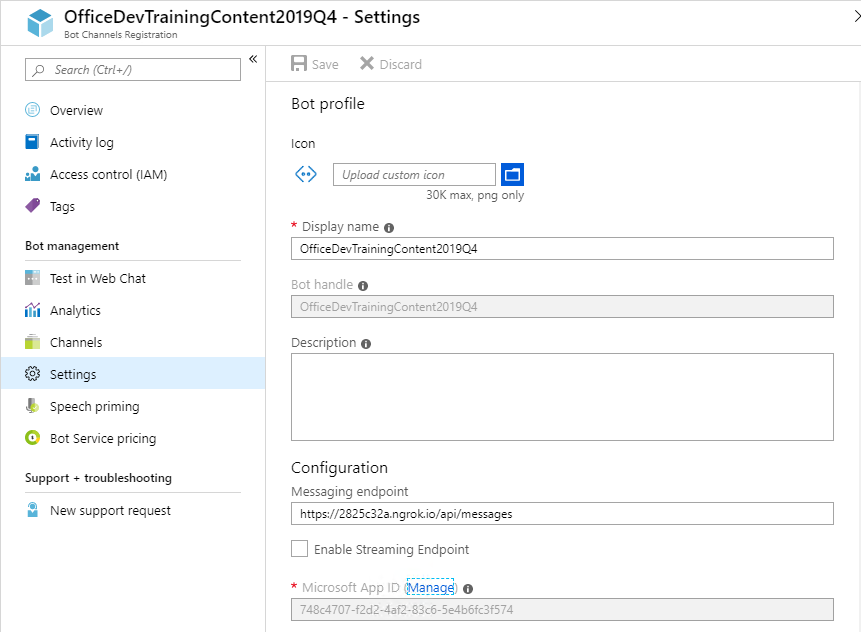
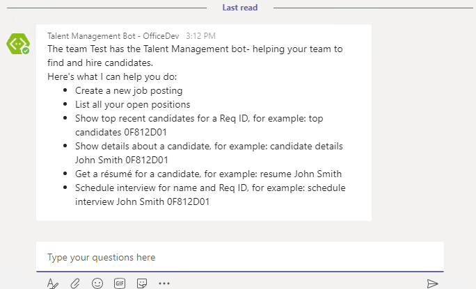

# Sending and receiving files

In this demo, you will demonstrate a bot that receives a file from a user and sends a file to a user in the  Microsoft Teams desktop application.

## Prerequisites

Developing apps for Microsoft Teams requires preparation for both the Office 365 tenant and the development workstation.

For the Office 365 Tenant, the setup steps are detailed on the [Prepare your Office 365 Tenant page](https://docs.microsoft.com/en-us/microsoftteams/platform/get-started/get-started-tenant).

### Azure Subscription

The Azure Bot service requires an Azure subscription. A free trial subscription is sufficient.

If you do not wish to use an Azure Subscription, you can use the legacy portal to register a bot here: [Legacy Microsoft Bot Framework portal](https://dev.botframework.com/bots/new) and sign in. The bot registration portal accepts a work, school account or a Microsoft account.

### Download ngrok

As Microsoft Teams is an entirely cloud-based product, it requires all services it accesses to be available from the cloud using HTTPS endpoints. To enable the exercises to work within Microsoft Teams, a tunneling application is required.

This lab uses [ngrok](https://ngrok.com) for tunneling publicly-available HTTPS endpoints to a web server running locally on the developer workstation. ngrok is a single-file download that is run from a console.

## Update Demo solution

Make the following updates to the demo solution.

1. Launch Visual Studio 2017 as an administrator.

1. In Visual Studio 2017, select **File > Open > Project/Solution**.

1. Select the **officedev-talent-management.sln** file from the **Demos\01-send-receive-files** folder.

### Find the project URL

1. In Solution Explorer, double-click on **Properties**.

1. In the properties designer, select the **Web** tab.

1. Note the project URL.

    

### Run the ngrok secure tunnel application

1. Open a new **Command Prompt** window.

1. Change to the directory that contains the **ngrok.exe** application.

1. Run the command `ngrok http [port] -host-header=localhost:[port]`. Replace `[port]` with the port portion of the URL noted above.

1. The ngrok application will fill the entire prompt window. Make note of the forwarding address using HTTPS. This address is required in the next step.

1. Minimize the ngrok command prompt window. It is no longer referenced in this lab, but it must remain running.

    

### Register the bot

1. Open the [Azure Portal](https://portal.azure.com).

1. Select **Create a resource**.

1. In the **Search the marketplace** box, enter `bot`.

1. Choose **Bot Channels Registration**

1. Select the **Create** button.

1. Complete the **Bot Channels Registration** blade. For the **Bot name**, enter a descriptive name.

1. Enter the following address for the **Messaging endpoint**. Replace the token `[from-ngrok]` with the forwarding address displayed in the ngrok window.

    ```
    https://[from-ngrok].ngrok.io/api/Messages
    ```

1. Allow the service to auto-create an application.

1. Select **Create**.

1. When the deployment completes, navigate to the resource in the Azure portal. In the left-most navigation, select **All resources**. In the **All resources** blade, select the Bot Channels Registration.

    

1. In the **Bot Management** section, select **Channels**.

    

1. Click on the Microsoft Teams logo to create a connection to Teams. Select **Save**. Agree to the Terms of Service.

    

#### Record the Bot Channel Registration Bot Id and secret

1. In the **Bot Channels Registration** blade, select **Settings** under **Bot Management**

1. The **Microsoft App Id** is displayed. Record this value.

1. Next to the **Microsoft App Id**, select the **Manage** link. This will open the Application Registration Portal in a new tab. If prompted, select the button titled **View the app in the Azure Portal".

1. In the application blade, select **Certificates & Secrets**.

1. Select **New client secret**.

1. Enter a description and select an expiration interval. Select **Add**.

1. A new secret is created and displayed. Record the new secret.

    

### Configure the web project

The bot project must be configured with information from the registration.

1. In **Visual Studio**, open the **Web.config** file. Locate the `<appSettings>` section.

1. Enter the `MicrosoftAppId` from the **Configuration** section of the registration.

1. Enter the `MicrosoftAppPassword`, the auto-generated app password displayed in the dialog box during registration.

    > **Note:** If you do not have the app password, the bot must be deleted and re-registered. An app password cannot be reset nor displayed.

1. Open the **manifest.json** file just added to the project. The `manifest.json` file requires several updates:
    - The `id` property must contain the app ID from registration. Replace the token `[microsoft-app-id]` with the app ID.
    - The `packageName` property must contain a unique identifier. The industry standard is to use the bot's URL in reverse format. Replace the token `[from-ngrok]` with the unique identifier from the forwarding address.
    - The `developer` property has three URLs that should match the hostname of the Messaging endpoint. Replace the token `[from-ngrok]` with the unique identifier from the forwarding address.
    - The `botId` property in the `bots` collection property also requires the app ID from registration. Replace the token `[microsoft-app-id]` with the app ID.
    - Save and close the **manifest.json** file.

1. Press **F5** to build the solution and package and start the web service in the debugger. The debugger will start the default browser, which can be ignored. The next step uses the teams client.

### Upload app into Microsoft Teams

Although not strictly necessary, in this lab the bot will be added to a new team.

1. In the Microsoft Teams application, select the **Add team** link. Then select the **Create team** button.

    

1. Enter a team name and description. In this example, the team is named **teams-bot-1**. Select **Next**.

1. Optionally, invite others from your organization to the team. This step can be skipped in this lab.

1. The new team is shown. In the left-side panel, select the ellipses next to the team name. Choose **Manage team** from the context menu.

    

1. On the Manage team display, select **Apps** in the tab strip. Then select the **Upload a custom app** link at the bottom right corner of the application.

1. Select the zip file from the **bin** folder that represents your app. Select **Open**.

1. The app is displayed. The description and icon for the app is displayed.

    

    The app is now uploaded into the Microsoft Teams application and the bot is available.

    > **Note:** Adding the bot to a team invokes the system message **ConversationUpdated**. The code in `MessageHelpers.cs` determines if the message is in response to the bot being added, and initiates a 1:1 message with each member of the team.

    

The bot is now installed and ready to run.

## Receive a file from a user

1. In a private chat with the bot, the message compose area now includes the attachment icon. Selecting the icon presents a context menu with the supported choices for the source of the file.

    

1. Continue to select and upload a file. You must select the send button after the file is uploaded.

1. Navigate to the OneDrive folder of the user. Note that the file sent by the user was first uploaded to the **Microsoft Teams Chat Files** folder before being sent to the bot.

## Send a file to a user

1. In a private chat with the bot, issue the command `resume for john smith`. The bot will respond with a **FileConsent** card. The bot can only send files when consent is granted by the user.

1. Once consent is granted, the bot can upload the file to the OneDrive of the user. The bot will display a `FileInfo` card, enabling the user to view the file.

    

1. The bot will respond with a file card. The actual file is added to the OneDrive of the current user, in a folder named after the bot. In this demo, the folder is named **Applications\officedev-talent-management**.
