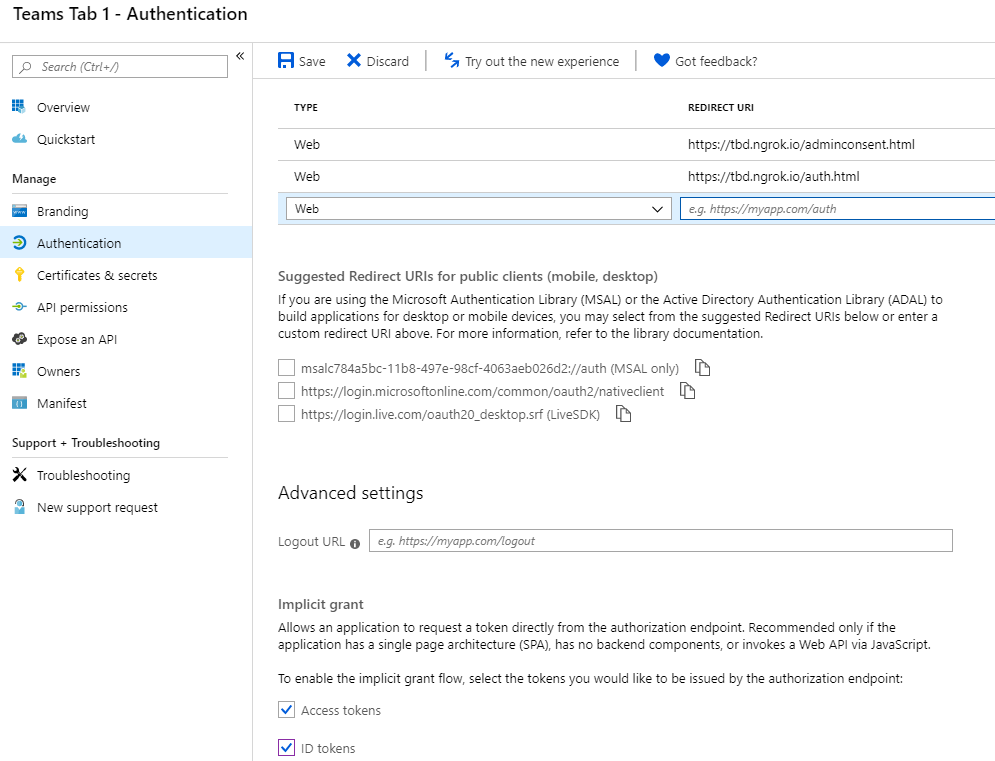
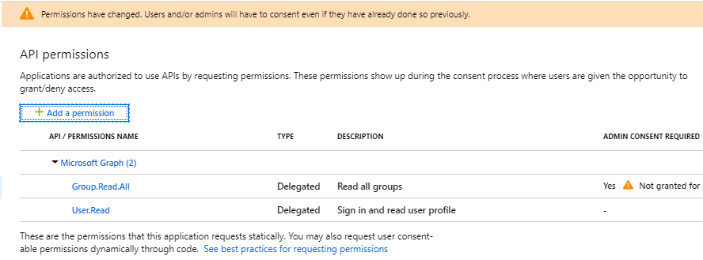
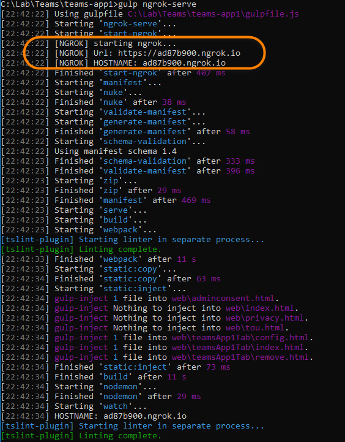
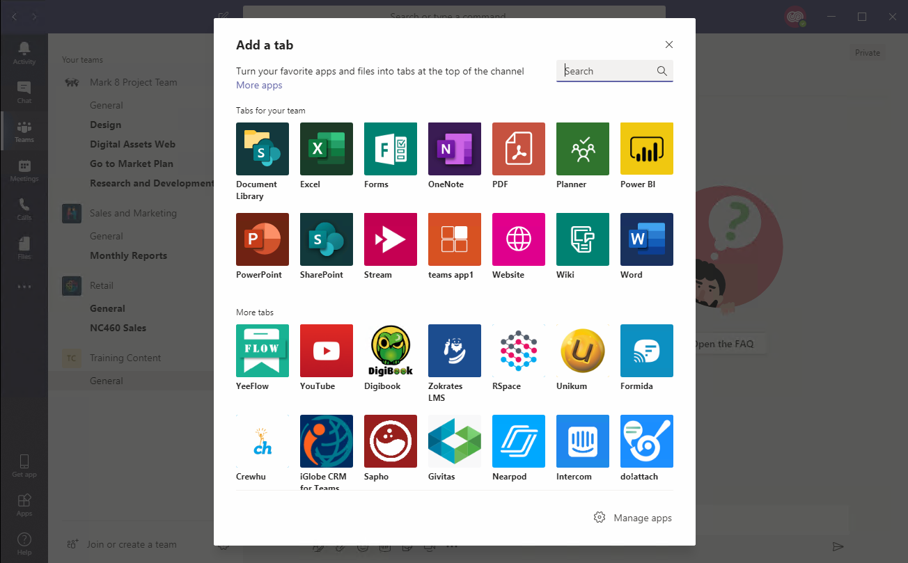

# Call the Microsoft Graph API inside a tab

In this demo, you will demonstrate calling the Microsoft Graph from TypeScript code in a Microsoft Teams tab.

1. Open the [Azure Active Directory admin center](https://aad.portal.azure.com).

1. Log in with the work or school account that is an administrator in the tenant.

1. Select **Azure Active Directory** in the left-most blade.

1. Select **App registrations** in the left-hand menu.

1. Select **New registration**.

1. Enter a name for the application.

1. Select **Accounts in this organizational directory only** for the **Supported account types**.

1. Enter the following address for the **Redirect URI**. Once the gulp task assigns an ngrok url, this will be updated. (The Sign-in URL is case-sensitive.)

    ```
    https://tbd.ngrok.io/auth.html
    ```

1. Select **Register**.

1. On the Overview blade, copy the **Application (client) ID** and the **Directory (tenant) ID**.

1. In the **Manage** section, select **Authentication**.

1. Add the following as an additional **Redirect URI**. Once the gulp task assigns an ngrok url, this will be updated. (The Sign-in URL is case-sensitive.)

    ```
    https://tbd.ngrok.io/adminconsent.html
    ```

1. In the **Implicit grant** section, select the box for **Access tokens** and **ID tokens**.

    

1. Select **Save** in top toolbar.

### Request permission to read groups

1. In the **Manage** section, select **API Permissions**.

1. Select **Add a permission**.

1. Select **Microsoft Graph**.

1. Select **Delegated Permissions**. Select **Group.Read.All**. Select **Add permissions**.

    

### Run the local web server and update ngrok address

1. In the command window, run the following command:

    ```shell
    gulp ngrok-serve
    ```

1. Locate the ngrok hostname assigned in the command window.

    

1. Update the Azure Application registration. The **Redirect URI** addresses must have the ngrok hostname.

  

## Upload app into Microsoft Teams

Although not strictly necessary, in this demo you will add the bot to a new team.

1. In the Microsoft Teams application, select the ellipses next to the team name. Choose **Manage team** from the menu.

    

1. On the Manage team menu, select **Apps** in the tab strip. Then select the **Upload a custom app** link at the bottom right corner of the application. If you don't have this link, check the sideload settings in the [Getting Started article](https://msdn.microsoft.com/en-us/microsoft-teams/setup).

    

1. Select the **teams-app-1.zip** file from the **package** folder. Select **Open**.

    

1. The app is displayed. Notice information about the app from the manifest (Description and Icon) is displayed.

    

The app is now uploaded into the Microsoft Teams application and the tab is available in the **Tab Gallery**.

### Add tab to team view

1. Add the tab to a channel, or update the settings of the tab in the existing channel. To update the settings of an existing tab, select the chevron next to the tab name.

    

1. Click the **Provide administrator consent - click if Tenant Admin** button.

    

1. Verify that the Azure Active Directory login and consent flow completes. If you log in with an account that is not a tenant administrator, the consent action will fail. Admin consent is only necessary to view the group calendar, not the member information.

    

1. Select the **Get Microsoft Graph Data** button to invoke the authentication and call to **graph.microsoft.com**.

    
