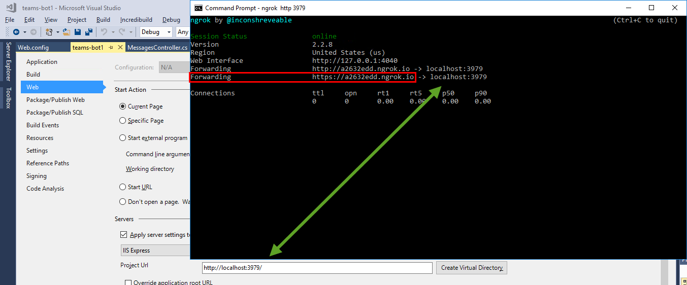
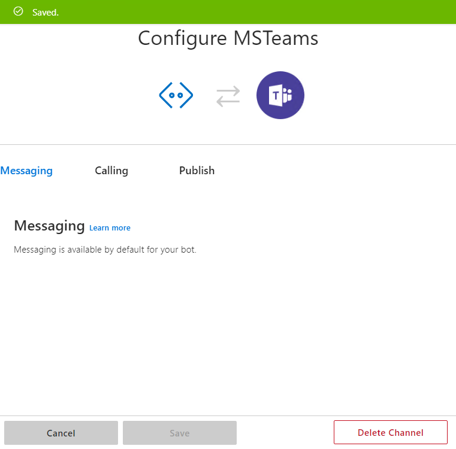
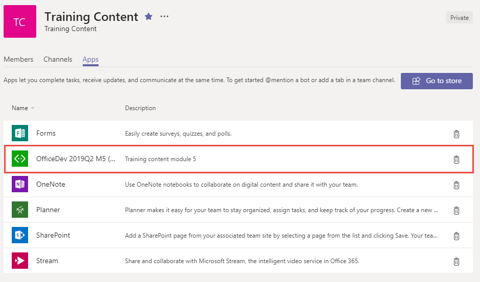
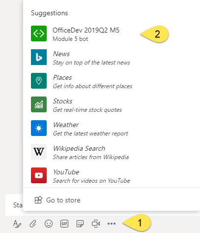
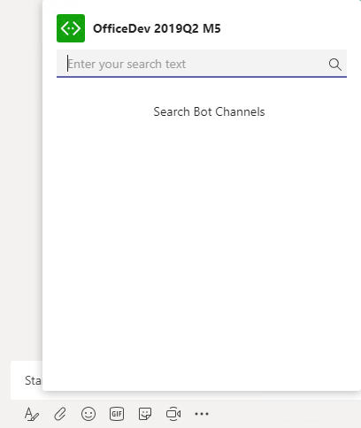
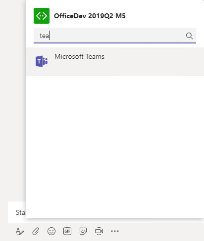

# Create a Messaging Extension

In this demo, you will demonstrate the messaging extension capability of Microsoft Teams.

## Prerequisites

Developing apps for Microsoft Teams requires preparation for both the Office 365 tenant and the development workstation.

For the Office 365 Tenant, the setup steps are detailed on the [Prepare your Office 365 tenant page](https://docs.microsoft.com/en-us/microsoftteams/platform/get-started/get-started-tenant). Note that while the getting started page indicates that the Public Developer Preview is optional, this lab includes steps that are not possible unless the preview is enabled. Information about the Developer Preview program and participation instructions are detailed on the [What is the Developer Preview for Microsoft Teams? page](https://docs.microsoft.com/en-us/microsoftteams/platform/resources/dev-preview/developer-preview-intro).

### Download ngrok

As Microsoft Teams is an entirely cloud-based product, it requires all services it accesses to be available from the cloud using HTTPS endpoints. To enable the exercises to work within Microsoft Teams, a tunneling application is required.

This lab uses [ngrok](https://ngrok.com) for tunneling publicly-available HTTPS endpoints to a web server running locally on the developer workstation. ngrok is a single-file download that is run from a console.

## Run the ngrok secure tunnel application

1. Open a new **Command Prompt** window.

1. Change to the directory that contains the **ngrok.exe** application.

1. Run the command `ngrok http [port] -host-header=localhost:[port]` Replace `[port]` with the port portion of the URL noted above.

1. The ngrok application will fill the entire prompt window. Make note of the forwarding address using https. This address is required in the next step.

1. Minimize the ngrok command prompt window. It is no longer referenced in this lab, but it must remain running.

    

## Register the bot

> This demo can use the same bot registration as Demo 1.

1. Open the [Azure Portal](https://portal.azure.com).

1. Select **Create a resource**.

1. In the **Search the marketplace** box, enter `bot`.

1. Choose **Bot Channels Registration**

1. Select the **Create** button.

1. Complete the **Bot Channels Registration** blade. For the **Bot name**, enter a descriptive name.

1. Enter the following address for the **Messaging endpoint**. Replace the token `[from-ngrok]` with the forwarding address displayed in the ngrok window.

    ```
    https://[from-ngrok].ngrok.io/api/Messages
    ```

1. Allow the service to auto-create an application.

1. Select **Create**.

1. When the deployment completes, navigate to the resource in the Azure portal. In the left-most navigation, select **All resources**. In the **All resources** blade, select the Bot Channels Registration.

1. In the **Bot Management** section, select **Channels**.

    

1. Click on the Microsoft Teams logo to create a connection to Teams. Select **Save**. Agree to the Terms of Service.

    

#### Record the Bot Channel Registration Bot Id and secret

1. In the **Bot Channels Registration** blade, select **Settings** under **Bot Management**

    

1. The **Microsoft App Id** is displayed. Record this value.

1. Next to the **Microsoft App Id**, select the **Manage** link. This will navigate to the Application Registration blade.

1. In the application blade, select **Certificates & Secrets**.

1. Select **New client secret**.

1. Enter a description and select an expiration interval. Select **Add**.

1. A new secret is created and displayed. Record the new secret.

    

## Update Demo solution

Make the following updates to the demo solution.

1. Launch **Visual Studio 2017**.

1. In **Visual Studio 2017**, select **File > Open > Project/Solution**.

1. Select the **teams-m5-bot.sln** file from the **Demos\02-messaging-extension\solution** folder.

1. Open the **Web.config** file. Locate the `<appSettings>` section.

1. Enter the `MicrosoftAppId`. The `MicrosoftAppId` is the app ID from the **Configuration** section of the registration.

1. Enter the `MicrosoftAppPassword`. The `MicrosoftAppPassword` is the client secret added in the Azure Portal Application Registration.

1. Save and close the **web.config** file.

1. Open the **manifest.json** file just added to the project. The `manifest.json` file requires several updates:
    - The `id` property must contain the app ID from registration. Replace the token `[microsoft-app-id]` with the app ID.
    - The `packageName` property must contain a unique identifier. The industry standard is to use the bot's URL in reverse format. Replace the token `[from-ngrok]` with the unique identifier from the forwarding address.
    - The `developer` property has three URLs that should match the hostname of the Messaging endpoint. Replace the token `[from-ngrok]` with the unique identifier from the forwarding address.
    - The `botId` property in the `bots` collection property also requires the app ID from registration. Replace the token `[microsoft-app-id]` with the app ID.
    - Save and close the **manifest.json** file.

1. Press F5 to compile the project, build the app package and start the web server. The default browser will open. This browser window is not necessary for the demo.

## Upload app into Microsoft Teams

1. In the left-side panel, select the ellipses next to the team name. Choose **Manage team** from the context menu.

    

1. On the Manage team display, select **Apps** in the tab strip. Then select the **Upload a custom app** link at the bottom right corner of the application.

1. Select the file **teams-m5-bot.zip** from the **bin** folder. Select **Open**.

1. The app is displayed. The description and icon for the app is displayed.

    

    The app is now uploaded into the Microsoft Teams application and the bot is available.

## Invoke the Compose Extension

The messaging extension is configured for use in a channel due to the scopes entered in the manifest.

1. The extension is invoked by selecting the **ellipsis** below the compose box and selecting the bot.

    

1. The extension is displayed. If the **initialRun** property is set to `true`, the extension is invoked and the results displayed. Since the **initialRun** property is `false`, the **description** is displayed. Note that the **parameters/description** property is displayed as an input hint in the search box.

    

1. Type in the search box. After several characters are entered, the messaging extension is called and the results displayed. (Search for `sky` to see multiple results.)


    

1. Select a result card. The selected card is inserted into the message compose area. The user can augment the message with text as desired. The card/message is not sent until the users selects the send button.

    